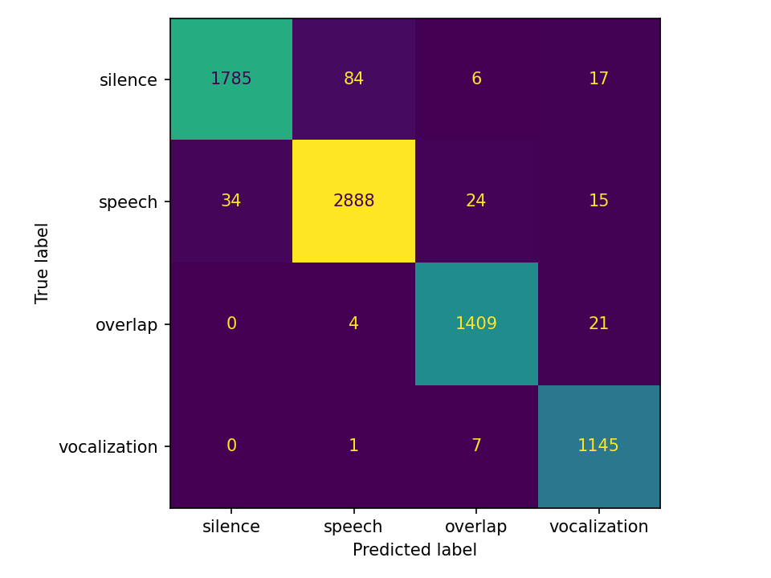

# VADNet: Four-Class Conversational Audio Classifier

A lightweight PyTorch model that classifies short audio frames into four conversational categories: **silence**, **speech**, **overlap**, and **non-vocal**. Built from scratch as part of a real-time speaker diarization pipeline.

---

## What It Does

Most voice activity detectors (VADs) answer a single binary question: *is someone speaking?* VADNet goes further, distinguishing between:

| Class | Description |
|---|---|
| `silence` | No speech activity, pauses |
| `speech` | A single speaker talking |
| `overlap` | Two or more speakers talking simultaneously |
| `non-vocal` | Non-linguistic sounds: breathing, tapping, etc. |

This richer labeling feeds directly into a diarization pipeline, where knowing *when* speakers overlap is as important as knowing *who* is speaking.

---

## Results

### Evaluation on Held-Out Set

```
Overall accuracy:   97.37%

Per-class accuracy:
  Silence        95.67%  (1810/1892)
  Speech         97.33%  (2882/2961)
  Overlap        98.61%  (1414/1434)
  non-vocal      99.70%  (1138/1153)
```

### Confusion Matrix



### Best Training Epoch (51/60)

```
Balanced accuracy:  92.5%

Per-class accuracy:
  Silence        89.3%
  Speech         93.3%
  Overlap        92.8%
  non-vocal      94.5%
```

Balanced accuracy is reported alongside overall accuracy to penalise models that ignore minority classes. A model that predicts "speech" for everything would score ~40% on overall accuracy but near 25% balanced.

### Experiment History

| Run | Key Change | Balanced Accuracy |
|---|---|---|
| A | Baseline, equal class weights | 75.7% |
| B | WeightedRandomSampler + weight tuning | 82.0% |
| C | Gradient clipping, label smoothing, mixup | 82.4% |
| D | ResBlock architecture, normalization, energy gate, fixed AMI labeling | 92.5% |

---

## Architecture

`VADNet` classifies each 30ms frame using a context window of 7 frames (210ms of history). Each frame in the window is encoded by a shared residual network, then a causal LSTM reads the sequence and produces a context-aware representation for the final frame.

```
Input: 7 frames x 128 features
    |
    v  (applied independently to each frame)
Linear(128 -> 512) -> LayerNorm -> GELU -> Dropout(0.3)
    |
    v
ResBlock(512) -> ResBlock(512)
    |
    v  (sequence of 7 frame embeddings)
LSTM(512 -> 128, causal, 1 layer)
    |
    v  (hidden state at final frame)
Linear(128 -> 64) -> LayerNorm -> GELU -> Dropout(0.2)
    |
    v
Linear(64 -> 4)   <- raw logits
```

Each `ResBlock` is: `Linear -> LayerNorm -> GELU -> Dropout -> Linear -> LayerNorm` with a residual skip connection. The LSTM is causal (unidirectional), so inference never looks ahead of the current frame.

---

## Features (128-dim vector per frame)

Each audio frame is converted to a fixed-length feature vector before training or inference:

| Feature | Dim | Purpose |
|---|---|---|
| MFCC means | 40 | Timbral/spectral content |
| MFCC delta means | 40 | First-order temporal dynamics |
| MFCC delta-delta means | 40 | Second-order temporal dynamics |
| Log energy | 1 | Frame loudness |
| Zero-crossing rate | 1 | Noisiness / unvoiced content |
| Spectral flatness | 1 | Tonal vs. noise-like signal |
| Spectral centroid | 1 | Perceived brightness |
| Spectral rolloff | 1 | Energy distribution |
| Voiced fraction | 1 | Proportion of voiced frames (F0 < 400Hz) |
| Spectral entropy | 1 | Chaos in spectrum, high during overlap |
| Harmonic ratio | 1 | Ratio of harmonic to total energy, low during overlap |

Feature vectors are normalized using mean and std computed from the training set, saved to `preprocessed_features/mean.npy` and `preprocessed_features/std.npy` and applied consistently at both train and inference time.

---

## Training Details

### Dataset

- **LibriSpeech** (`train-clean-100`) — clean read speech, labeled `speech` and `silence`. Augmented with additive noise, MP3 compression simulation, and reverb. Synthetic silence frames (pure zeros and very-low-amplitude noise) generated programmatically to cover truly silent audio.
- **AMI Meeting Corpus** — multi-speaker meeting room recordings, labeled `speech`, `overlap`, `silence`, and `non-vocal`. Overlap detected by counting distinct active speakers per frame using per-speaker word-level annotations.

### Inference Energy Gate

- Frames with RMS below 0.001 are hard-assigned to `silence` before feature extraction
- Zero and near-zero audio produces degenerate feature vectors that the model cannot reliably classify
- Bypassing the model for these frames eliminates a systematic failure mode at no accuracy cost

### Class Imbalance Strategy

- **WeightedRandomSampler** resamples each training batch so every class appears roughly equally
- **Class-weighted cross-entropy** applies higher loss penalties to minority class misclassifications

```python
# Loss weights: [silence, speech, overlap, non-vocal]
weights = torch.tensor([1.0, 1.0, 1.3, 1.2])
criterion = nn.CrossEntropyLoss(weight=weights, label_smoothing=0.05)
```

### Data Augmentation

Applied to training frames only (never validation):

| Augmentation | Probability | Purpose |
|---|---|---|
| Gaussian noise | 50% | Microphone/environment variation |
| MFCC frequency masking | 50% | SpecAugment-style frequency dropout |
| Delta block zeroing | 30% | SpecAugment-style time masking |
| Delta-delta masking | 20% | Second-order dropout |
| Volume scale jitter | 40% | Recording level variation |

### Other Training Choices

- **Mixup** (beta=0.1): blends pairs of training samples to smooth decision boundaries
- **Gradient clipping** (max norm=1.0): prevents loss spikes during early training
- **ReduceLROnPlateau** scheduler: halves LR after 3 epochs without validation improvement
- **Best checkpoint** saved on balanced accuracy, not validation loss

---

## Key Design Decisions

- `f0_mean` removed as a feature: LibriSpeech's narrow F0 distribution caused real-world conversational speech to be misclassified as non-vocal. `voiced_frac` retained as it is more robust to this distribution shift.
- `spectral_entropy` and `harmonic_ratio` added specifically to improve overlap discrimination, as two simultaneous speakers produce more chaotic spectra and weaker harmonicity than a single voice.
- ESC-50 removed entirely: too many spectrally ambiguous categories (breathing, crowd noise, ambient sounds) bleed into silence and speech feature space. non-vocal training data now comes from AMI vocalsound annotations only (laughter, coughing, sneezing).
- AMI overlap labeling uses per-speaker binary masks before summing across speakers. The naive approach of summing all word events into one counter caused adjacent speaker turns to falsely trigger overlap at boundaries.
- A 20ms shrink is applied to AMI word boundaries to prevent bleed between consecutive words from different speakers.
- A causal LSTM with a 7-frame context window (210ms) was added to give the model temporal context across frames. The LSTM reads frame embeddings produced by the shared residual encoder and outputs a context-aware representation used for classification. Frames before the start of a sequence are zero-padded. The LSTM is unidirectional so inference remains causal and real-time compatible.

---

## Project Structure

```
four-class-nlp-model/
├── ml/
│   ├── labeling/
│   │   ├── label_librispeech.py    # Speech + synthetic silence frames
│   │   ├── label_ami.py            # Speech, overlap, silence, non-vocal from AMI
│   │   └── merge_labels.py         # Combines CSVs, balances class counts
│   ├── dataset.py                  # VADDataset, feature extraction
│   └── model.py                    # VADNet architecture
├── models/
│   └── custom_vad.pt               # Best saved checkpoint
├── preprocessed_features/
│   ├── features.npy                # Precomputed 128-dim feature vectors
│   ├── labels.npy                  # Corresponding string labels
│   ├── mean.npy                    # Per-feature training mean
│   └── std.npy                     # Per-feature training std
├── testing/
│   ├── test_data/                  # Audio files for manual testing
│   ├── test_results/               # Visualization outputs
│   ├── frame_divider.py            # Splits audio into frames for inspection
│   └── record_audio.py             # Records audio from microphone for testing
├── training/
│   ├── train_data/                 # Raw labeled audio
│   ├── evaluate.py                 # Per-class evaluation + confusion matrix
│   ├── precompute_features.py      # Extracts and saves features + mean/std
│   ├── train.py                    # Training loop with checkpointing
│   ├── training_model.ipynb        # Colab notebook for GPU training
│   └── upload_to_hf.py             # Uploads preprocessed features to Hugging Face
├── config.py                       # Shared constants (SAMPLE_RATE, FRAME_MS)
├── confusion_matrix.png            # Latest evaluation confusion matrix
└── demo.py                         # Run inference on any audio file
```

---

## Running It

### Prerequisites

```bash
python -m venv .venv
source .venv/bin/activate
pip install torch librosa numpy pandas tqdm soundfile scipy webrtcvad
```

### Creating Training Data

```bash
python ml/labeling/label_librispeech.py
python ml/labeling/label_ami.py
python ml/labeling/merge_labels.py
```

### Precompute Features

```bash
python training/precompute_features.py
```

Saves `features.npy`, `labels.npy`, `mean.npy`, and `std.npy` to `preprocessed_features/`.

### Train

```bash
rm -f models/checkpoint_latest.pt models/custom_vad.pt
python training/train.py
```

Training saves a checkpoint after every epoch and resumes from it if interrupted. The best model by balanced accuracy is saved to `models/custom_vad.pt`.

### Evaluate

```bash
python training/evaluate.py
```

Reports overall accuracy, per-class accuracy, and saves a confusion matrix to `confusion_matrix.png`.

### Demo

```bash
python demo.py test_data/your_audio.wav
```

Runs inference on any audio file and saves a timeline visualization to `testing/test_results/`.

---

## License

MIT
